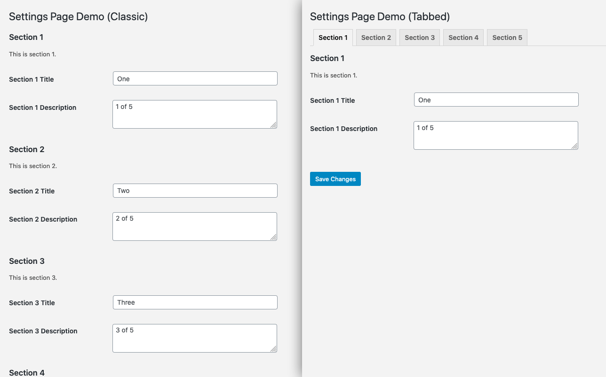

# WP-Admin Tabbed Settings Pages (Polyfill)

[](https://travis-ci.com/stevegrunwell/wp-admin-tabbed-settings-pages)
[](https://core.trac.wordpress.org/ticket/51086)

This package contains a polyfill for [WordPress Core Trac ticket #51086](https://core.trac.wordpress.org/ticket/51086), wherein a standard for tabbed settings pages within WP-Admin has been proposed.

The proposal centers around a new function as part of [the Settings API](https://codex.wordpress.org/Settings_API): `do_tabbed_settings_sections()`, which is identical to [`do_settings_sections()`](https://developer.wordpress.org/reference/functions/do_settings_sections/) except that each section is rendered in a separate tab.



As a bonus, the included script respects the URL hash, enabling browser history for tabs as well as the ability to link directly to specific tabs!

Best of all, you don't have to wait for WordPress Core to accept the change to start using it today, as this package contains the same code (and is maintained by the person who submitted the Trac ticket). This version of the code is even designed to step aside if it detects the function within WordPress core sometime in the future!

## Installation

To run this polyfill as a stand-alone WordPress plugin, [grab the latest zip file]() and install it as you would any other WordPress plugin.

If you'd rather bundle this as a dependency in another plugin, you may load it via Composer:

```sh
$ composer require stevegrunwell/wp-admin-tabbed-settings-pages
```

It's worth noting that the `composer.json` does not include the plugin bootstrap file in the autoloader, so it's necessary to explicitly require this file after WordPress has been loaded (such as when your plugin is loading):

```php
// Please adjust this path as appropriate.
require_once __DIR__ . '/vendor/stevegrunwell/wp-admin-tabbed-settings-pages/wp-admin-tabbed-settings-pages.php';
```

## Usage

As long as you're leveraging the [WordPress Settings API](https://codex.wordpress.org/Settings_API), the only change necessary is replacing your call to `do_settings_sections($page)` with `do_tabbed_settings_sections($page)`.

For an example of how this might look, [please see the WP-Admin Tabbed Settings Pages demo plugin attached to the Trac ticket](https://core.trac.wordpress.org/attachment/ticket/51086/wp-admin-tabbed-settings-pages-demo.php).
